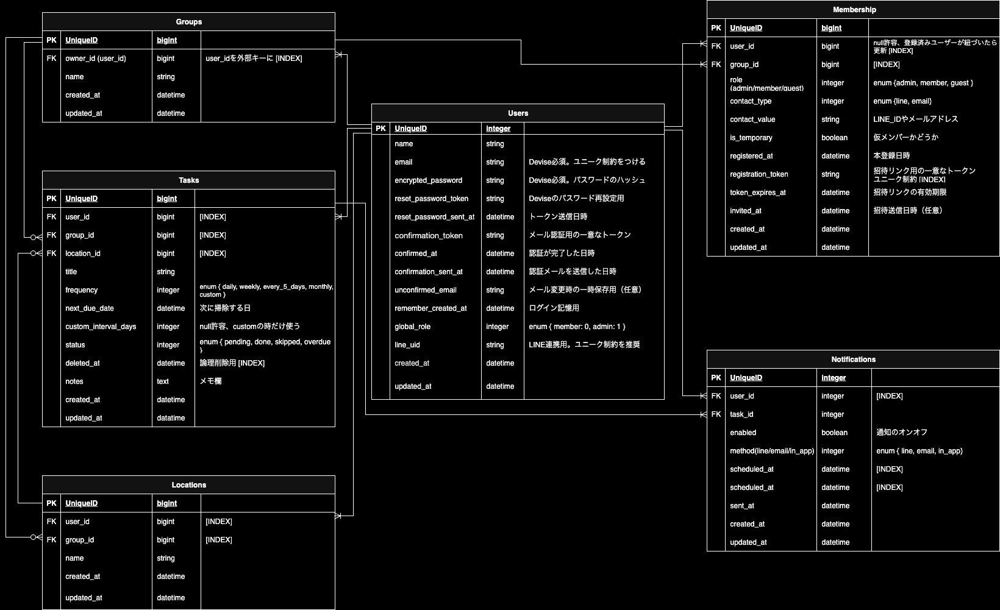

# おそうじ予定表

## ■サービス概要
**どんなサービスなのかを３行で説明してください。**

## ■ このサービスへの思い・作りたい理由
**このサービスの題材となるものに関してのエピソードがあれば詳しく教えてください。  このサービスを思いつくにあたって元となる思いがあれば詳しく教えてください。**

## ■ ユーザー層について
**決めたユーザー層についてどうしてその層を対象にしたのかそれぞれ理由を教えてください。**

## ■サービスの利用イメージ
**ユーザーがこのサービスをどのように利用できて、それによってどんな価値を得られるかを簡単に説明してください。**  

## ■ ユーザーの獲得について
**想定したユーザー層に対してそれぞれどのようにサービスを届けるのか現状考えていることがあれば教えてください。**  

## ■ サービスの差別化ポイント・推しポイント
**似たようなサービスが存在する場合、そのサービスとの明確な差別化ポイントとその差別化ポイントのどこが優れているのか教えてください。**  
**独自性の強いサービスの場合、このサービスの推しとなるポイントを教えてください。**

## ■ 機能候補
**現状作ろうと思っている機能、案段階の機能をしっかりと固まっていなくても構わないのでMVPリリース時に作っていたいもの、本リリースまでに作っていたいものをそれぞれ分けて教えてください。**

**〜MVPリリースまで〜**
**〜本リリースまで〜** 

## ■ 機能の実装方針予定
**一般的なCRUD以外の実装予定の機能についてそれぞれどのようなイメージ(使用するAPIや)で実装する予定なのか現状考えているもので良いので教えて下さい。**

## ■画面遷移図

## ■ER図
https://app.diagrams.net/#G1qBC4JL1WaGSBezSnMEGa6WqqpluB9Xvi#%7B%22pageId%22%3A%22-tXvySkc4d2MTamq8V34%22%7D

