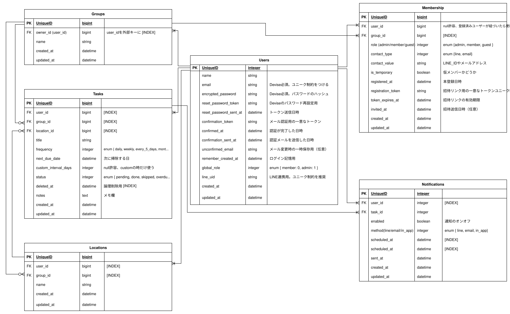

# おそうじ予定表  

## ■サービス概要
**どんなサービスなのかを３行で説明してください。**  
  
このアプリは掃除のタイミングを可視化し、予定を管理するサービスです。  
掃除の場所、タスクごとに最後に掃除してからの経過日数が一目でわかります。  
掃除のタイミングを通知設定することもでき、家族など複数人で共有することも可能です。  

## ■ このサービスへの思い・作りたい理由
**このサービスの題材となるものに関してのエピソードがあれば詳しく教えてください。  このサービスを思いつくにあたって元となる思いがあれば詳しく教えてください。**  
  
このサービスは、兄に子どもが産まれ、急な来客が増えたことをきっかけに考えました。  
「ちょっと荷物を取りにor置きに」などで来訪1時間くらい前に連絡が来て、慌てて準備することもあるので  
いつお客様が来ても慌てず迎えられるよう、家を綺麗に管理できたらと思いました。
  
## ■ ユーザー層について
**決めたユーザー層についてどうしてその層を対象にしたのかそれぞれ理由を教えてください。**  
  
想定ユーザーとその理由  
① 家事を日常的にこなす主婦・主夫層（20〜50代）  
理由:掃除の予定を可視化・管理したい、家族と分担して掃除を計画したい、曜日ごとのルーチンを整理したい
  
② 一人暮らしの若年層（大学生・社会人）  
理由：掃除を忘れがちな層にとって、リマインダーや視覚的な管理が助けになる  
  
③ ADHDや片付けが苦手な人向けのセルフマネジメント支援  
理由：視覚的な整理や「やることの見える化」が行動のきっかけになる、習慣化を促すツールとして機能する

## ■サービスの利用イメージ
**ユーザーがこのサービスをどのように利用できて、それによってどんな価値を得られるかを簡単に説明してください。**  
  
ユーザーは掃除した場所やタスクを登録することで、次に掃除すべきタイミングが一目でわかるようになります。  
「最後に掃除した日」からの経過日数が表示されるため、感覚ではなくデータで掃除の優先度を判断できます。  
また、通知機能や共有機能を活用すれば、次にいつ掃除する予定なのかわかり、家族や同居人と掃除を分担しながら綺麗な空間を保てます。
## ■ ユーザーの獲得について
**想定したユーザー層に対してそれぞれどのようにサービスを届けるのか現状考えていることがあれば教えてください。**  
  
・掃除を完了したらX(Twitter)に掃除完了の投稿ができる機能を予定しています。投稿を見た人にサービスを知ってもらえるきっかけになればと考えています。  
・グループを作ればユーザー登録していない人にも通知を送ることができるので、そこから登録URLに案内を記載予定です。
## ■ サービスの差別化ポイント・推しポイント
**似たようなサービスが存在する場合、そのサービスとの明確な差別化ポイントとその差別化ポイントのどこが優れているのか教えてください。**  
【類似サービスと差別化ポイント】  
『Tody』  
差別化ポイント：LINE通知
『掃除管理アプリ - PikaPika』  
差別化ポイント：ユーザー登録していない人への通知機能、予定日の前後で掃除した場合の日数カウント調整  
『おそうじログ』  
差別化ポイント：複数人でのグループ作成・通知機能
**独自性の強いサービスの場合、このサービスの推しとなるポイントを教えてください。**

## ■ 機能候補
**現状作ろうと思っている機能、案段階の機能をしっかりと固まっていなくても構わないのでMVPリリース時に作っていたいもの、本リリースまでに作っていたいものをそれぞれ分けて教えてください。**  
  
**〜MVPリリースまで〜**
ユーザー登録・ログイン（Deviseによる認証機能）  
掃除場所（Location）の登録・編集・削除  
掃除タスク（Task）の登録・編集・完了ステータス切り替え  
タスクの頻度設定と次回掃除予定日の自動計算  
掃除履歴の表示（last_done_at に基づく経過日数）  
掃除通知の設定（in-app通知）  
可視性と親しみやすさを意識したUI（HTML CSS） 
  
**〜本リリースまで〜**  
グループ機能（Group）とメンバー管理（Membership）  
掃除予定の共有と分担（グループ内でのLocation/Task共有）  
通知方法の拡張（LINE連携・メール通知）  
ゲスト招待機能（トークンによる一時参加）  
Twitter共有ボタン（「掃除完了！」をワンタップ投稿）  
管理者向け画面（global_roleによる権限分岐）  
ソフトデリート対応（deleted_atによる論理削除）  

## ■ 機能の実装方針予定
**一般的なCRUD以外の実装予定の機能についてそれぞれどのようなイメージ(使用するAPIや)で実装する予定なのか現状考えているもので良いので教えて下さい。**  
  
- 通知機能（in-app / LINE / email）  
  - Notification モデルに scheduled_at を持たせ、ActiveJob + Sidekiq で非同期通知を実装予定。  
  - LINE通知は LINE Messaging API を使用し、ユーザーの line_uid をもとにメッセージ送信。  
- 掃除頻度の自動計算  
  - Task モデルの frequency に応じて next_due_date を算出。  
  - custom_interval_days を使った柔軟な間隔設定も可能。
- グループ共有機能  
  - Group と Membership を用いて、ユーザー間の掃除タスク共有を実現。  
  - group_role によって編集権限を制御し、is_temporary によるゲスト参加も可能。
- Twitter共有ボタン  
  - JavaScriptで window.open() を使い、Twitter投稿用URLに掃除完了メッセージを埋め込む。
  - DBには履歴を残さず、フロントのみで完結。  
- (未定)バッジ機能  
  - Task の完了回数を集計し、条件に応じてバッジを付与。  
  - UserBadge モデルを追加し、獲得履歴を管理予定。 SNS共有は任意。
## ■画面遷移図

## ■ER図
https://app.diagrams.net/#G1qBC4JL1WaGSBezSnMEGa6WqqpluB9Xvi#%7B%22pageId%22%3A%22-tXvySkc4d2MTamq8V34%22%7D
